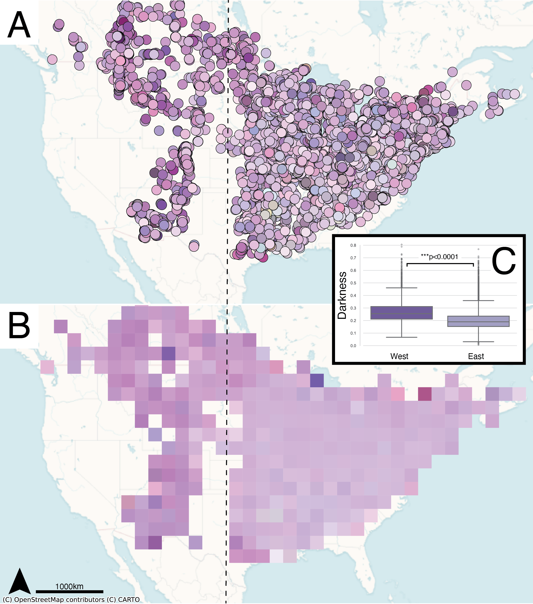

# Range-wide Analysis of Monarda fistulosa flower color with iNaturalist data

We apply the following pipeline:  
1) GBIF export of all Monarda fistulosa observations in North America  
* `raw_data/`  
2) Download all images associated with these observations  
* `notebooks_pipeline/1_download_write_images.ipynb`  
3) Query chatGPT to filter image dataset to only those images featuring flowers  
* `notebooks_pipeline/2_gpt_filtering.ipynb`  
* Raw batch submission files and output files in `gpt_raw_labeling/`  
4) Merge the GPT outputs to make a dataframe mapping images to "YES" or "NO" to whether they contain a flower  
* `notebooks_pipeline/3_merging_filtering_gpt.ipynb`  
* `gpt_image_filtering.csv`  
5) Filter out images to only include those containing flowers  
* `notebooks_pipeline/3_merging_filtering_gpt.ipynb`  
6) Randomly sample some images to train a segmentation model on Roboflow  
* `notebooks_pipeline/3_merging_filtering_gpt.ipynb`  
7) Manually annotate photos on the Roboflow platform and perform model training to recognize "flower" pixels  
* `"https://segment.roboflow.com/monarda_fistulosa_segmentation/1?api_key={your_api_key}"`  
8) Query the trained segmentation model for every image containing flowers  
* `notebooks_pipeline/4_query_segmentation_model.ipynb`  
* All segmented masks in: `segmentation_results.zip`  
9) Use the segmentation mask to extract "flower" pixels and apply k-means clustering to
identify the dominant color among the extracted pixels.  
* `notebooks_pipeline/5_create_full_dataframe.ipynb`  
10) Save a composite dataframe containing all images, their corresponding occurrence ids, the dominant color
identified (in multiple color codes), and latitude and longitude.  
* `notebooks_pipeline/5_create_full_dataframe.ipynb`  
* Composite dataframe: `filtered_labeled_data.csv`  

# Primary data files  

* Composite dataframe: `filtered_labeled_data.csv`  
* Segmentation masks: `segmentation_results.zip`  
* **To download all images labeled as containing flowers:** `download_image_dataset.ipynb`  
* Raw GBIF export: `raw_data/`  

# Figures -- code in notebooks_figures

  

  

  