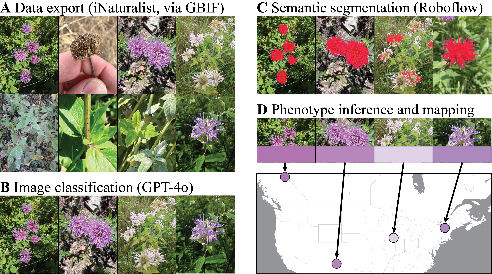
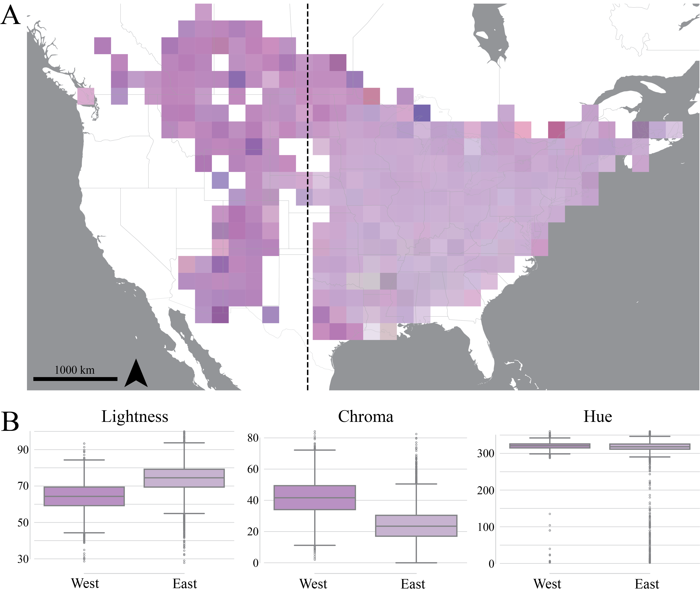
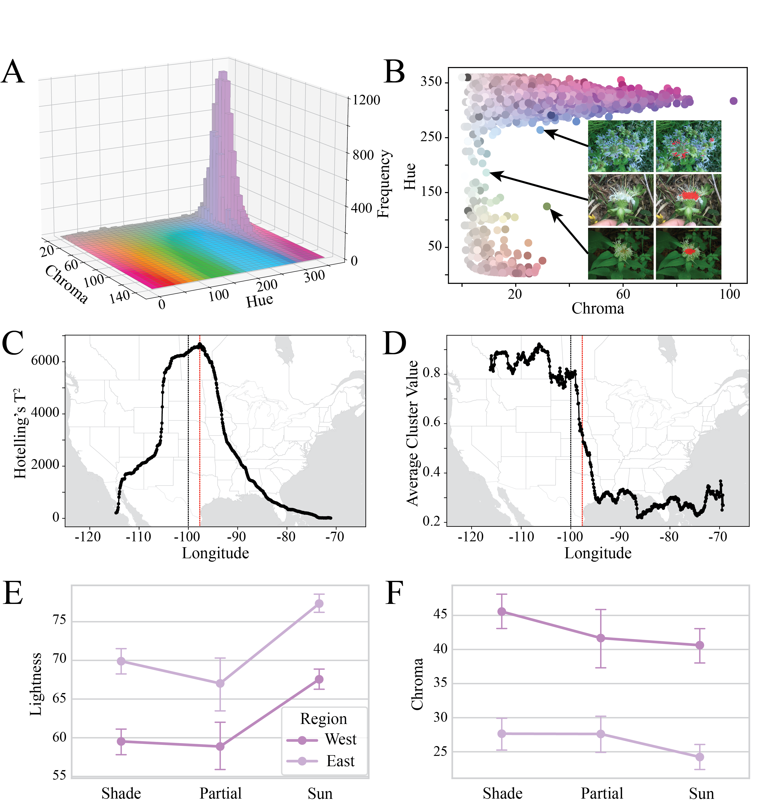

# Range-wide analysis of *Monarda fistulosa* flower color with [iNaturalist](https://www.inaturalist.org/) data

We apply the following pipeline:  
1) [GBIF](https://www.gbif.org/) export of all Monarda fistulosa observations in North America  
* Method: GBIF in-browser export tools  
* Data file: `raw_data/`  
2) Download all images associated with these observations  
* Method: jupyter notebook (python)  
* `notebooks_pipeline/1_download_write_images.ipynb`  
3) Query chatGPT to filter image dataset to identify which images feature flowers  
* Method: jupyter notebook (python)  
* `notebooks_pipeline/2_gpt_filtering.ipynb`  
* Raw batch submission files and GPT output files in `gpt_raw_labeling/`  
4) Merge the GPT outputs to make a dataframe mapping images to "YES" or "NO" to whether they contain a flower  
* Method: jupyter notebook (python)  
* `notebooks_pipeline/3_merging_filtering_gpt.ipynb`  
* Data file: `gpt_image_filtering.csv`  
5) Using csv with GPT labels, filter out images to only include those containing flowers  
* Method: jupyter notebook (python)  
* `notebooks_pipeline/3_merging_filtering_gpt.ipynb`  
6) Randomly sample some images to train a segmentation model on [Roboflow](https://roboflow.com/)  
* Method: jupyter notebook (python)  
* `notebooks_pipeline/3_merging_filtering_gpt.ipynb`  
7) Manually annotate photos on the Roboflow platform and train model to recognize "flower" pixels  
* Method: Roboflow in-browser tools for upload, image annotation, and model training
* [Trained model](https://universe.roboflow.com/patricks-dashboard/monarda_fistulosa_segmentation/model/1)  
* API: `"https://segment.roboflow.com/monarda_fistulosa_segmentation/1?api_key={your_api_key}"`  
8) Query the trained segmentation model for every image containing flowers  
* Method: jupyter notebook (python)  
* `notebooks_pipeline/4_query_segmentation_model.ipynb`  
* All segmented masks in: `segmentation_results.zip`  
9) Use the segmentation mask to extract "flower" pixels and apply geometric median to
identify the dominant color among the extracted pixels.  
* Method: jupyter notebook (python)  
* `notebooks_pipeline/5_create_full_dataframe.ipynb`  
10) Save a composite dataframe containing all images, their corresponding occurrence ids, the dominant color
identified (in multiple color codes), and latitude and longitude.  
* Method: jupyter notebook (python)  
* `notebooks_pipeline/5_create_full_dataframe.ipynb`  
* Composite dataframe: `datasets/geo_med.csv`  

# Primary data files  

* Composite dataframe: `datasets/geo_med.csv`  

Intermediates:  
* Raw GBIF export: `raw_data/`  
* Image idxs containing flowers: `gpt_image_filtering.csv`  
* Segmentation masks: `segmentation_results.zip`  
* All color-labeled images (to download): `download_image_dataset.ipynb`  

# Figures -- code in notebooks_figures

## Figure 1: Figure pipeline.  
  

## Figure 2: Spatial distribution of Monarda fistulosa color and west vs. east comparison.  
  

## Figure 3: Validation figures.  
  